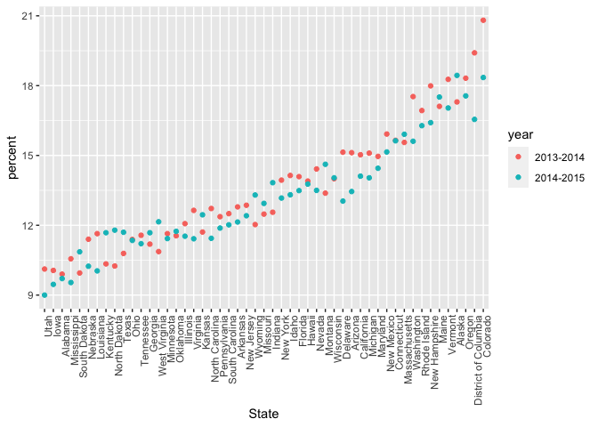

Strings and factors
================

## string vectors

``` r
string_vec = c("my", "name", "is", "jeff")

str_detect(string_vec, "m")
```

    ## [1]  TRUE  TRUE FALSE FALSE

``` r
str_replace(string_vec, "jeff", "Jeff")
```

    ## [1] "my"   "name" "is"   "Jeff"

``` r
string_vec = c(
  "i think we all rule for participating",
  "i think i have been caught",
  "i think this will be quite fun actually",
  "it will be fun, i think"
  )

str_detect(string_vec, "^i think")
```

    ## [1]  TRUE  TRUE  TRUE FALSE

``` r
str_detect(string_vec, "i think$")
```

    ## [1] FALSE FALSE FALSE  TRUE

``` r
string_vec = c(
  "Y'all remember Pres. HW Bush?",
  "I saw a green bush",
  "BBQ and Bushwalking at Molonglo Gorge",
  "BUSH -- LIVE IN CONCERT!!"
  )

str_detect(string_vec,"[Bb]ush") # upper or lower case
```

    ## [1]  TRUE  TRUE  TRUE FALSE

``` r
string_vec = c(
  '7th inning stretch',
  '1st half soon to begin. Texas won the toss.',
  'she is 5 feet 4 inches tall',
  '3AM - cant sleep :('
  )

str_detect(string_vec, "^[0-9][a-zA-Z]") #everything in[]. # follow by pattern
```

    ## [1]  TRUE  TRUE FALSE  TRUE

``` r
string_vec = c(
  'Its 7:11 in the evening',
  'want to go to 7-11?',
  'my flight is AA711',
  'NetBios: scanning ip 203.167.114.66'
  )

str_detect(string_vec, "7.11") #7 follow by anything then 11
```

    ## [1]  TRUE  TRUE FALSE  TRUE

``` r
string_vec = c(
  'The CI is [2, 5]',
  ':-]',
  ':-[',
  'I found the answer on pages [6-7]'
  )

str_detect(string_vec, "\\[") # look for [
```

    ## [1]  TRUE FALSE  TRUE  TRUE

``` r
vec_sex = factor(c("male", "male", "female", "female"))
as.numeric(vec_sex)
```

    ## [1] 2 2 1 1

``` r
vec_sex = fct_relevel(vec_sex, "male")
as.numeric(vec_sex)
```

    ## [1] 1 1 2 2

## NSDUH

``` r
nsduh_url = "http://samhda.s3-us-gov-west-1.amazonaws.com/s3fs-public/field-uploads/2k15StateFiles/NSDUHsaeShortTermCHG2015.htm"

table_marj = 
  read_html(nsduh_url) %>% 
  html_table() %>% 
  first() %>% # only want first one
  slice(-1)

data_marj = 
  table_marj %>%
  select(-contains("P Value")) %>% # no p value columns
  pivot_longer(
    -State, # no state column
    names_to = "age_year", 
    values_to = "percent") %>%
  separate(age_year, into = c("age", "year"), sep = "\\(") %>%
  mutate(
    year = str_replace(year, "\\)", ""),
    percent = str_replace(percent, "[a-c]$", ""),
    percent = as.numeric(percent)) %>%
  filter(!(State %in% c("Total U.S.", "Northeast", "Midwest", "South", "West")))
```

do dataframe stuff

``` r
data_marj %>%
  filter(age == "12-17") %>% 
  mutate(State = fct_reorder(State, percent)) %>% # get a graph with smooth trend
  ggplot(aes(x = State, y = percent, color = year)) + 
    geom_point() + 
    theme(axis.text.x = element_text(angle = 90, hjust = 1)) # rotate x-axis text
```

<!-- -->
